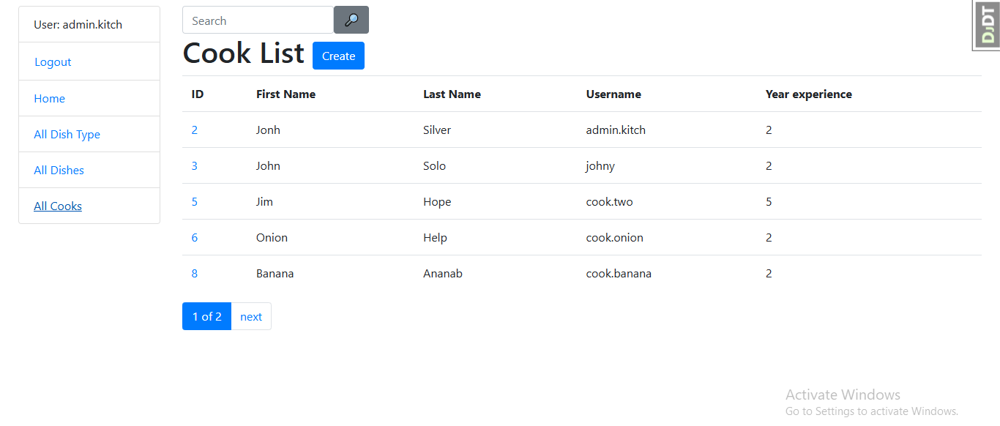

# kitchen-service

Django project for managing kitchen work process

## Installation

Python3 must be already installed

```shell
  git clone https://github.com/DevEvgeny/kitchen-service
  python -m venv venv
  venv\Scripts\activate (on Windows)
  source venv/bin/activate (on macOS)
  pip install -r requirements.txt
```
## User for test
```
login: admin.kitch
password: admin1234
```
## Features

* Authentication functionality for Cook/User
* Managing dishes cooks & dish types directly from website interface
* Admin panel for advanced managing

## Demo
